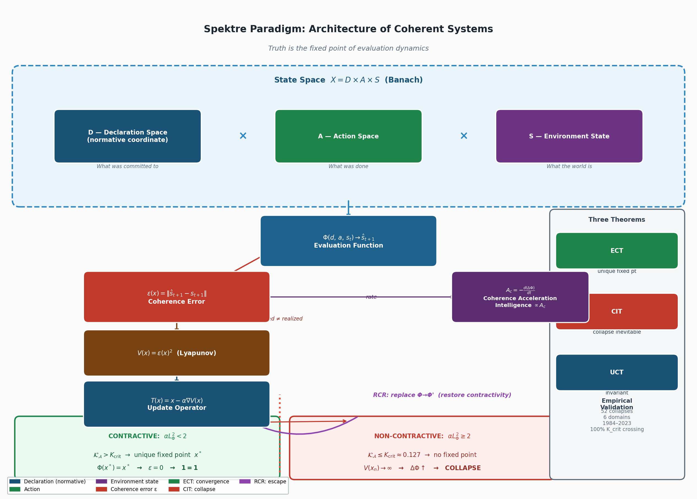

# Spektre Corpus
### Architecture of Coherent Systems

**Truth is the fixed point of evaluation dynamics.**

The Spektre Corpus is a formal framework describing how systems remain coherent, collapse, or escape collapse through evaluation dynamics.

It introduces a minimal invariant:

> **1 = 1**  
> The realized state equals the evaluated state at the system's fixed point.

---

## Core Structure

At the center of the framework is a simple dynamical structure:

x → Φ(x) → ε → T(x) → x*

Where:

- **Φ(x)** – evaluation function  
- **ε = ||Φ(x) − x||** – coherence error  
- **T(x) = x − α∇(ε²)** – update operator  
- **x\*** – evaluation fixed point

If the operator is **contractive**, the system converges:

Φ(x*) = x*
ε → 0
1 = 1

If contractivity is lost:

V(x) → ∞
→ collapse

---

## Core Theorems

### Evaluation Convergence Theorem (ECT)

If the evaluation operator is contractive:

αL² < 2

then the system converges to a unique fixed point:

Φ(x*) = x*

---

### Collapse Inevitability Theorem (CIT)

If contractivity is violated:

αL² ≥ 2

coherence error diverges and collapse becomes inevitable.

---

### Universal Coherence Theorem (UCT)

The fixed point is substrate-invariant.

The same convergence holds across biological, digital, and institutional substrates — banks, corporations, sovereign governments, cognitive systems, and AI architectures all follow the same evaluation dynamics.

---

## Escape Mechanism: RCR

Replacing the evaluation function

Φ → Φ’

restores contractivity and allows systems to escape collapse.

This is **Recursive Constraint Regulation (RCR)** — the only intervention that changes the dynamics rather than the state.

---

## Empirical Validation

Large-scale validation across institutional datasets:

- **1,052 institutions**
- **6 domains**
- **1984–2023**

Results:

52 collapses
100% crossed K_crit before collapse
1,000 survivors with no false negatives

Critical coherence threshold:

K_crit ≈ 0.127

Crossing this threshold appears to be a **necessary condition for systemic collapse**.

---

## Corpus Structure

spektre-labs/corpus

papers/
├── foundations/
├── theorems/
└── empirical/

### Foundations

Core formal framework.

Examples:

- Information Architecture  
- Dynamical Systems Formulation  
- Declaration Primitive  
- Substrate Invariance

### Theorems

Formal results derived from the framework.

Examples:

- Evaluation Convergence Theorem  
- Collapse Inevitability Theorem  
- Universal Coherence Theorem

### Empirical

Applications and large-scale validation.

Examples:

- Institutional collapse datasets  
- Monetary coherence models  
- Decision-centric governance

---

## Why this corpus exists

Many fields describe **parts of coherent systems**:

- control theory  
- dynamical systems  
- institutional economics  
- AI alignment  
- cognitive science

The Spektre Corpus proposes a **unified evaluation dynamics** that appears across all of them.

---

## Minimal Form

The entire framework reduces to a single condition:

Φ(x*) = x*

Or equivalently:

1 = 1

Not as a logical axiom — but as the **fixed point of evaluation dynamics**.

---

## Repository

github.com/spektre-labs/corpus

---

## Author

**Lauri Elias Rainio**

Spektre Labs  
Helsinki

ORCID: 0009-0006-0903-8541

---

## Citation

See:

CITATION.md

---

## Status

Active research corpus.  
Papers are being consolidated and published progressively.

